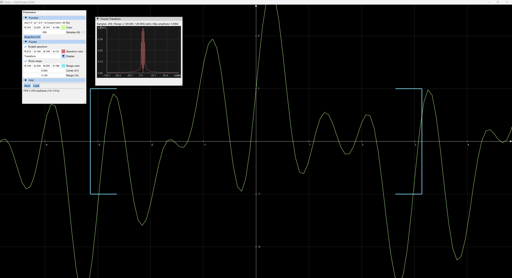

# 📐 ImGui + DirectX9 Function Plotter

A Windows application that uses **Dear ImGui**, **DirectX9**, and **ExprTk** for interactive visualization of a coordinate grid, axes, mathematical function plots, and Fourier transforms.

---

## 🚀 Features
- Render coordinate grid and axes with tick labels  
- Customizable colors: background, grid, axes, shapes  
- Input function `f(x)` (supports `sin(x)`, `cos(x)`, `x^2`, `exp(x)`, etc.)  
- Adjustable grid spacing and scaling  
- **Fourier transform visualization** with configurable display modes and parameters  
- Save/load configuration (`config.ini`) with extended options for Fourier settings  
- Enhanced GUI controls for Fourier parameters  
- Clean OOP architecture: classes `App`, `RendererDX9`, `GuiManager`, `Scene`, `AppConfig`

---

## 🖼️ Demo

  

---

## ⚙️ Build

### Requirements
- Windows (MSVC / Visual Studio)  
- [Dear ImGui](https://github.com/ocornut/imgui) (with backends `imgui_impl_dx9.cpp`, `imgui_impl_win32.cpp`)  
- DirectX9 SDK (included in Windows SDK)  
- [ExprTk](https://github.com/ArashPartow/exprtk) (for expression parsing)

---

## 📝 Configuration

The application loads settings from `config.ini`.  
Includes options for:
- Grid/axis colors and spacing  
- Fourier transform center, range, and display toggles  
- Function expression  

This makes it easy to reproduce and share visualization setups.
